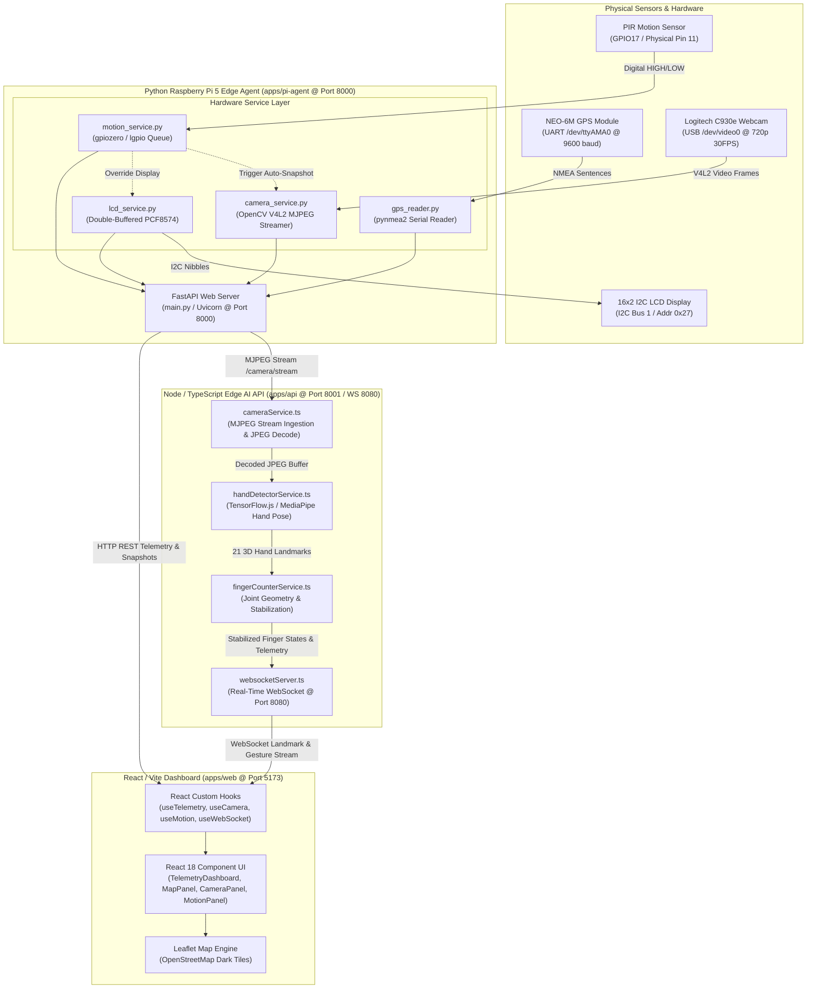
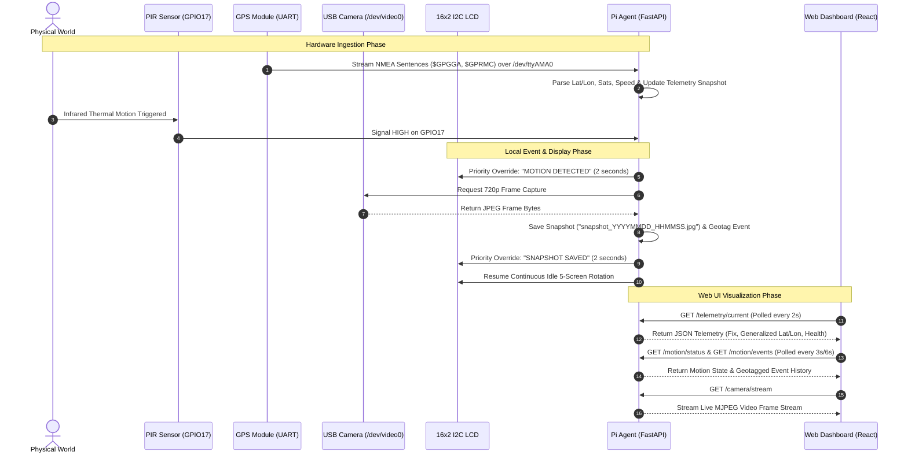

# FieldTrack AI

> **Edge Telemetry, Computer Vision, and Industrial Sensing Platform for Raspberry Pi 5**

FieldTrack AI is an open-source, industrial-grade edge telemetry and hardware sensing platform built on Raspberry Pi 5. It bridges physical instrumentation—including GPS serial telemetry, passive infrared (PIR) motion detection, high-definition USB video streaming, and I2C 16x2 LCD status displays—with a high-performance Python FastAPI backend and a dark industrial React/TypeScript web dashboard.

---

## Table of Contents

- [1. Project Title and Overview](#1-project-title-and-overview)
- [2. Controls to Code Mission](#2-controls-to-code-mission)
- [3. Major Capabilities](#3-major-capabilities)
- [4. System Architecture](#4-system-architecture)
- [5. Monorepo Structure](#5-monorepo-structure)
- [6. Hardware Components](#6-hardware-components)
- [7. Complete Raspberry Pi Pinout and Termination Table](#7-complete-raspberry-pi-pinout-and-termination-table)
- [8. Electrical Requirements and Safety](#8-electrical-requirements-and-safety)
- [9. Communication Protocols](#9-communication-protocols)
- [10. Hardware Signal Flow](#10-hardware-signal-flow)
- [11. Backend Architecture](#11-backend-architecture)
- [12. Frontend Architecture](#12-frontend-architecture)
- [13. API Endpoint Documentation](#13-api-endpoint-documentation)
- [14. Local Development Setup](#14-local-development-setup)
- [15. Raspberry Pi Setup](#15-raspberry-pi-setup)
- [16. Mac-to-Pi Deployment using rsync](#16-mac-to-pi-deployment-using-rsync)
- [17. Environment Variable Documentation](#17-environment-variable-documentation)
- [18. Testing, Linting, and Production Build Commands](#18-testing-linting-and-production-build-commands)
- [19. Troubleshooting Guide](#19-troubleshooting-guide)
- [20. Deployment Status](#20-deployment-status)
- [21. Security and Privacy Controls](#21-security-and-privacy-controls)
- [22. Screenshots and Demonstration Video](#22-screenshots-and-demonstration-video)
- [23. Educational Curriculum Applications](#23-educational-curriculum-applications)
- [24. Roadmap](#24-roadmap)
- [25. Author and Acknowledgments](#25-author-and-acknowledgments)

---

## 1. Project Title and Overview

**FieldTrack AI** is an enterprise-grade IoT edge monitoring solution designed to run natively on Raspberry Pi 5 Linux environments while supporting cross-platform development on macOS and Linux workstations. The platform collects real-time GPS positioning, monitors ambient motion via PIR digital inputs, streams 720p 30 FPS MJPEG video, manages automated snapshot captures, and drives a local 16x2 HD44780 I2C character display—all orchestrated by an asynchronous FastAPI backend and visualized through a Vite/React dashboard featuring Leaflet OpenStreetMap integration.

### Primary Target Audiences

1. **Recruiters & Hiring Managers**: Demonstrates full-stack systems engineering, Linux IPC, hardware integration, asynchronous Python, reactive TypeScript/React UI design, and production security patterns.
2. **Software & Embedded Engineers**: Serves as a reference implementation for non-blocking GPIO event queues, V4L2 video capture, NMEA serial sentence ingestion, double-buffered I2C LCD rendering, and monorepo code structure.
3. **Controls to Code Curriculum Students**: Offers a step-by-step hands-on bridge connecting breadboard wiring, voltage regulation, and physical sensors to modern cloud-ready software APIs.

---

## 2. Controls to Code Mission

> **“Built in the field. Engineered in software.”**

The **Controls to Code** philosophy represents the convergence of hands-on physical industrial instrumentation (controls, wiring, relays, sensors, and electrical measurement) with modern software craftsmanship (asynchronous Python, REST APIs, reactive web frameworks, and cloud architecture). 

FieldTrack AI was developed to demonstrate that hardware signals at the edge should not be isolated in proprietary PLCs or closed microcontrollers; instead, every physical edge signal can be ingested, validated, geotagged, and presented in a real-time web UI with clean software abstractions.

---

## 3. Major Capabilities

- **Live Serial GPS Telemetry**: Direct UART ingestion (`/dev/ttyAMA0` @ 9600 baud) parsing `$GPGGA` and `$GPRMC` NMEA sentences with satellite tracking, HDOP precision measurement, speed calculation, data age tracking, and seamless fallback to mock telemetry when hardware is disconnected.
- **Privacy-Preserving Geolocation Mapping**: Interactive Leaflet / OpenStreetMap visualizer with privacy safeguards. Displays device location generalized to 2 decimal places (~1.1 km accuracy) with a visual proximity radius, hiding raw high-precision GPS coordinates from public web dashboards.
- **Edge Computer Vision & MJPEG Streaming**: Dedicated background V4L2 OpenCV video capture engine delivering 1280x720 @ 30 FPS MJPEG video streams (`/camera/stream`) and on-demand camera snapshot generation (`/camera/snapshot`).
- **PIR Motion Monitoring & Automated Event Capture**: Asynchronous GPIO input tracking (BCM GPIO17) with 30-second sensor stabilization warm-up, 10-second snapshot cooldown safeguard, automated camera snapshot trigger, GPS geotagging, and bounded in-memory event logging (`deque(maxlen=100)`).
- **Double-Buffered 16x2 I2C LCD Rotation**: Native PCF8574 I2C backpack driver supporting a continuous 5-screen telemetry rotation (`FIELDTRACK AI`, marquee scrolling text, camera/GPS state, motion state, CPU temperature) with priority motion/snapshot alert overrides and zero screen flicker.
- **Industrial Telemetry & Diagnostics**: Monitors serial link status, sentence checksum parse error rates, data age, camera actual FPS, and Raspberry Pi CPU temperature in real time.

---

## 4. System Architecture

FieldTrack AI follows a decoupled, multi-layer edge architecture consisting of three primary runtime subsystems:

1. **Python Raspberry Pi 5 Edge Agent (`apps/pi-agent`)**: Runs natively on the Single-Board Computer at `http://192.168.2.2:8000` (or `http://<pi-ip>:8000`). Manages physical hardware sensors via asynchronous background threads, providing Logitech C930e 720p 30 FPS MJPEG video streaming (`/camera/stream`), UART serial NMEA GPS parsing (`/telemetry/current`), PIR motion detection (`/motion/status`, `/motion/events`), automatic motion snapshot capture (`/camera/status`, `/camera/snapshot`), double-buffered PCF8574 I2C 16x2 LCD status rotation, and Raspberry Pi diagnostics (CPU temperature, uptime, serial health).
2. **Node / TypeScript Edge AI API (`apps/api`)**: Serves an edge REST API on `http://192.168.2.2:8001` and a low-latency WebSocket server on `ws://192.168.2.2:8080`. Consumes the live MJPEG video stream from `pi-agent` via `cameraService.ts`, decodes JPEG frames, executes real-time hand pose detection using TensorFlow.js and MediaPipe via `handDetectorService.ts`, extracts 21 3D hand landmarks, and calculates deterministic finger joint geometry and temporal stabilization via `fingerCounterService.ts`.
3. **React / Vite Web Dashboard (`apps/web`)**: Runs at `http://localhost:5173`. Connects to `pi-agent` for telemetry polling and video streaming, while maintaining a high-speed WebSocket connection with `apps/api` for real-time hand gesture tracking and dynamic visual alerts.

```
                    FIELDTRACK AI
                         │
         ┌───────────────┼────────────────┐
         │               │                │
         ▼               ▼                ▼
    React/Vite       Node/TS API      Python Pi Agent
     Dashboard        Edge AI           Hardware
         │               │                │
         │               │        ┌───────┼────────┐
         │               │        │       │        │
         │               │      Camera   GPS      PIR
         │               │
         │          TensorFlow.js /
         │          Hand Pose Detection
         │               │
         └──── WebSocket ┘
```

### Complete Layered System Architecture



### Real Physical Camera & AI Inference Pipeline

FieldTrack AI executes computer vision on real live camera frames captured from the physical Logitech C930e USB hardware:

```
Logitech C930e Camera
        ↓
Python Pi Agent (apps/pi-agent)
        ↓
MJPEG Video Stream (/camera/stream)
        ↓
Node cameraService (apps/api)
        ↓
JPEG Frame Decoding (jpeg-js)
        ↓
TensorFlow.js (tfjs-core / MediaPipe)
        ↓
Hand Pose Detection
        ↓
21 3D Hand Landmarks
        ↓
Finger Joint Geometry Evaluation
        ↓
Temporal Stabilization (Majority Voting)
        ↓
WebSocket Server (ws://192.168.2.2:8080)
        ↓
React Dashboard (apps/web)
```

---

## 5. Monorepo Structure

```
fieldtrack-ai/
├── apps/
│   ├── api/                       # Node.js / TypeScript Edge AI API & Hand Pose Server
│   │   ├── package.json           # Dependencies (@tensorflow/tfjs, @mediapipe/tasks-vision, ws, express)
│   │   ├── tsconfig.json          # TypeScript configuration
│   │   ├── models/                # Offline edge model storage
│   │   │   └── hand-pose/         # MediaPipe 3D Hand Pose detector & landmark model shards
│   │   ├── scripts/               # Downloader & helper scripts
│   │   │   └── download-models.js # Offline model setup script (npm run setup:models)
│   │   └── src/
│   │       ├── index.ts           # Express REST API & service entrypoint
│   │       ├── config.ts          # Environment variables & model configuration
│   │       ├── cameraService.ts   # MJPEG stream ingestion & JPEG frame decoder
│   │       ├── handDetectorService.ts # TensorFlow.js / MediaPipe hand pose inference engine
│   │       ├── fingerCounterService.ts # Deterministic 3D finger geometry & temporal stabilizer
│   │       ├── fingerCounterService.test.ts # Deterministic unit tests (9 passed, 0 failed)
│   │       ├── websocketServer.ts # High-throughput WebSocket server (Port 8080)
│   │       └── utils/             # Network address & helper utilities
│   ├── pi-agent/                  # Python FastAPI Raspberry Pi Edge Agent
│   │   ├── main.py                # FastAPI app routes & lifespan lifecycle handlers
│   │   ├── models.py              # Pydantic data models (Telemetry, CameraStatus, MotionStatus)
│   │   ├── gps_reader.py          # UART serial NMEA reader & mock telemetry engine
│   │   ├── camera_service.py      # OpenCV V4L2 MJPEG streaming & snapshot service
│   │   ├── motion_service.py      # gpiozero PIR motion detector & event buffer
│   │   ├── lcd_service.py         # PCF8574 16x2 I2C LCD driver & rotation manager
│   │   ├── pyrefly.toml           # Pyrefly Python configuration
│   │   ├── requirements.txt       # Python dependencies (fastapi, opencv, gpiozero, pynmea2)
│   │   ├── snapshots/             # Local directory for captured JPEG snapshots
│   │   └── tests/                 # Pytest automated test suite
│   │       ├── test_gps.py        # NMEA parsing & telemetry tests
│   │       ├── test_camera.py     # Camera status, MJPEG stream & snapshot tests
│   │       ├── test_motion.py     # Motion queue, cooldown, & event limit tests
│   │       └── test_lcd.py        # LCD 4-bit init, double buffering & marquee scroll tests
│   └── web/                       # React 18 / Vite Web Dashboard
│       ├── index.html             # Entry HTML document
│       ├── package.json           # Frontend dependencies (React, Vite, Leaflet, Lucide)
│       ├── vite.config.ts         # Vite build & proxy configuration
│       ├── src/
│       │   ├── main.tsx           # React entrypoint
│       │   ├── App.tsx            # Main application wrapper
│       │   ├── index.css          # Dark industrial CSS design system
│       │   ├── components/        # UI Panel Components
│       │   │   ├── Header.tsx             # Navigation header & connection indicator
│       │   │   ├── TelemetryDashboard.tsx # Main grid layout wrapper
│       │   │   ├── PositionPanel.tsx      # GPS metrics & fix status panel
│       │   │   ├── DeviceHealthPanel.tsx  # System health & CPU temperature panel
│       │   │   ├── MapPanel.tsx           # Leaflet OpenStreetMap privacy map
│       │   │   ├── CameraPanel.tsx        # Live MJPEG stream & snapshot preview panel
│       │   │   └── MotionPanel.tsx        # PIR state, alert banner & event history table
│       │   ├── hooks/             # Custom Polling React Hooks
│       │   │   ├── useTelemetry.ts     # Telemetry polling hook (2s interval)
│       │   │   ├── useCamera.ts        # Camera status & stream refresh hook (6s interval)
│       │   │   └── useMotion.ts        # Motion status (3s) & events hook (6s interval)
│       │   ├── lib/
│       │   │   └── api.ts             # API client methods & URL builders
│       │   └── types/             # TypeScript Type Definitions
│       │       ├── telemetry.ts   # Telemetry & DeviceHealth interfaces
│       │       ├── camera.ts      # CameraStatus & SnapshotResponse interfaces
│       │       └── motion.ts      # MotionStatus & MotionEvent interfaces
├── packages/
│   └── shared/                    # Shared workspace package placeholder
├── docs/                          # Project documentation directory
└── README.md                      # Primary repository documentation
```

---

## 6. Hardware Components

The physical hardware architecture consists of off-the-shelf industrial and hobbyist components powered by a Raspberry Pi 5 single-board computer:

| Component | Model / Specifications | Interface / Connection | Primary Role |
| :--- | :--- | :--- | :--- |
| **Single-Board Computer** | Raspberry Pi 5 (ARM Cortex-A76, 8GB RAM) | 40-Pin GPIO, USB 3.0, RJ45 | Edge compute, API host, and hardware controller |
| **GPS Module** | u-blox NEO-6M GPS Receiver with Ceramic Antenna | UART (`/dev/ttyAMA0`) @ 9600 Baud | Real-time global satellite positioning and NMEA ingestion |
| **Motion Sensor** | HC-SR501 Passive Infrared (PIR) Sensor | Digital Input (GPIO17 / Pin 11) | Human/object motion detection in sensor coverage zone |
| **Character Display** | 16x2 HD44780 LCD with PCF8574 I2C Backpack | I2C Bus 1 (Address `0x27` / `0x3F`) | Local hardware telemetry and status alert display |
| **RGB LED Ring** | Freenove 8-Pixel Addressable RGB Module (WS2812B) | GPIO Output (IN-S / GPIO18 / Pin 12) | Visual system state status, animation, motion alerts, and flash |
| **USB Camera** | Logitech C930e 1080p HD Webcam | USB 2.0/3.0 (`/dev/video0`) | Live MJPEG video stream (720p 30FPS) & snapshots |
| **Power Supply** | Raspberry Pi 27W USB-C (5.1V / 5A) | USB-C Power Port | Primary system power supply |
| **Breadboard Rail** | Solderless Breadboard Power Distribution | Jumper Wires to 5V & GND Pins | Centralized 5V VCC and GND distribution for sensors |

---

## 7. Complete Raspberry Pi Pinout and Termination Table

> [!CAUTION]
> **Electrical Safety Warning**: Raspberry Pi 5 GPIO pins operate strictly at **3.3V logic levels**. Connecting a 5V signal directly to a GPIO input pin without level shifting will permanently damage the Broadcom SoC GPIO bank. Ensure the HC-SR501 PIR sensor output line outputs a 3.3V digital signal (standard on HC-SR501 modules powered by 5V VCC).

### Detailed Pin Termination Table

| Device | Device Terminal | Raspberry Pi Signal | BCM GPIO | Physical Pin | Voltage | Direction | Protocol | Purpose | Notes |
| :--- | :--- | :--- | :--- | :--- | :--- | :--- | :--- | :--- | :--- |
| **PIR Sensor** | VCC | 5V Power Rail | - | Pin 2 / 4 | 5.15V DC | Power | Power | PIR Power Supply | Connected via breadboard 5V rail |
| **PIR Sensor** | GND | Ground Rail | - | Pin 6 / 9 / 14 | 0V | Ground | Power | Common System Ground | Connected via breadboard GND rail |
| **PIR Sensor** | OUT / Signal | GPIO 17 | GPIO17 | **Pin 11** | 3.3V Logic | Input | Digital GPIO | Motion Signal Input | HIGH = Motion, LOW = Clear |
| **NEO-6M GPS** | VCC | 5V Power Rail | - | Pin 2 / 4 | 5.15V DC | Power | Power | GPS Module Power | Module contains onboard 3.3V LDO |
| **NEO-6M GPS** | GND | Ground Rail | - | Pin 6 / 9 / 14 | 0V | Ground | Power | Common System Ground | Tied to common ground rail |
| **NEO-6M GPS** | TX | UART RXD | GPIO15 | **Pin 10** | 3.3V Logic | Input (to Pi) | UART Serial | NMEA Telemetry Ingestion | **Required**: GPS TX -> Pi RXD |
| **NEO-6M GPS** | RX | UART TXD | GPIO14 | Pin 8 | 3.3V Logic | Output (from Pi) | UART Serial | GPS Command Configuration | *Optional*: Not required for read-only NMEA |
| **16x2 LCD** | VCC | 5V Power Rail | - | Pin 2 / 4 | 5.15V DC | Power | Power | LCD & Backlight Power | PCF8574 VCC input |
| **16x2 LCD** | GND | Ground Rail | - | Pin 6 / 9 / 14 | 0V | Ground | Power | Common System Ground | Tied to common ground rail |
| **16x2 LCD** | SDA | I2C1 SDA | GPIO2 | **Pin 3** | 3.3V Logic | Bidirectional | I2C | Serial Data Line | Pull-up resistor on Pi header |
| **16x2 LCD** | SCL | I2C1 SCL | GPIO3 | **Pin 5** | 3.3V Logic | Output (from Pi) | I2C | Serial Clock Line | Pull-up resistor on Pi header |
| **Freenove RGB** | IN-S | GPIO 18 | GPIO18 | **Pin 12** | 3.3V Logic | Output (from Pi) | Addressable WS2812 | Data Signal Input | Connect Pi Pin 12 to IN-S |
| **Freenove RGB** | IN-V | 5V Power Rail | - | Pin 2 / 4 | 5.0V DC | Power | Power | Module Power | Connect 5V to IN-V |
| **Freenove RGB** | IN-G | Ground Rail | - | Pin 6 / 9 / 14 | 0V | Ground | Power | Common System Ground | Connect GND to IN-G |
| **Freenove RGB** | OUT | Unused | - | - | - | - | Cascading | Data Forwarding | Unused unless chaining modules |
| **Logitech C930e** | USB Cable | USB 3.0 Host | - | USB Port | 5.0V USB | Bidirectional | USB 2.0/3.0 | Video Stream & Snapshots | Linux V4L2 device node `/dev/video0` |
| **Ethernet** | RJ45 Cable | Gigabit Ethernet | - | RJ45 Port | Network | Bidirectional | Ethernet | Local Network Transport | TCP/IP network connectivity |

---

## 8. Electrical Requirements and Safety

1. **Power Budget**:
   - Raspberry Pi 5 base draw: ~3.0W - 5.0W.
   - Logitech C930e Webcam USB draw: ~1.5W (300mA @ 5V).
   - NEO-6M GPS receiver draw: ~225mW (45mA @ 5V).
   - 16x2 LCD + PCF8574 Backlight draw: ~250mW (50mA @ 5V).
   - HC-SR501 PIR Sensor draw: ~300µA idle / 50mA active.
   - Freenove 8 RGB LED Module draw: ~500mW max (100mA @ 5V with 20% brightness cap).
   - Total System Power: **~8.0W to 12.5W peak**. Powered by official 27W USB-C power supply.
2. **Common Ground**: All sensors and modules MUST share a single, common ground reference. Ground loops or floating ground potentials between the GPS module, PIR sensor, LCD, RGB LED module, and Raspberry Pi will cause signal corruption and communication drops.
3. **Logic Level Integrity**: The Raspberry Pi 5 Broadcom BCM2712 SoC inputs are **not 5V tolerant**. Always verify with a digital multimeter (DMM) that signal lines going into GPIO pins do not exceed 3.3V. While 3.3V logic signals sent to the 5V RGB LED module IN-S pin typically work, a 3.3V-to-5V level shifter is recommended for long cable runs.
4. **Raspberry Pi 5 RP1 Controller Driver Limitation**: The Raspberry Pi 5 replaces legacy peripheral registers with the custom RP1 I/O controller, rendering traditional `/dev/mem` DMA access used by `rpi_ws281x` unsupported unless SPI `/dev/spidev0.0` or custom overlays are configured. The agent safely falls back to `MockRGBDriver` whenever hardware access is unavailable.

---

## 9. Communication Protocols

FieldTrack AI utilizes standard layered network and hardware protocols:

```
+-----------------------------------------------------------------------+
| Application Layer     : HTTP/1.1 REST APIs, MJPEG Streaming           |
+-----------------------------------------------------------------------+
| Transport Layer       : TCP (Port 8000 API, Port 5173 Web UI), UDP    |
+-----------------------------------------------------------------------+
| Network Layer         : IP (IPv4 / IPv6 Routing & Addressing)         |
+-----------------------------------------------------------------------+
| Link / Physical Layer : Ethernet (IEEE 802.3 over RJ45) / Wi-Fi       |
+-----------------------------------------------------------------------+
| Hardware Serial/Bus   : UART (/dev/ttyAMA0), I2C (Bus 1), GPIO, USB   |
+-----------------------------------------------------------------------+
```

- **UART Serial**: Asynchronous serial communication on `/dev/ttyAMA0` at 9600 baud, 8 data bits, no parity, 1 stop bit (8N1). Transmits ASCII-formatted NMEA 0183 sentences (`$GPGGA`, `$GPRMC`) from the u-blox NEO-6M GPS receiver.
- **I2C (Inter-Integrated Circuit)**: Synchronous, multi-master 2-wire serial bus operating on I2C Bus 1 at 100 kHz. Uses BCM GPIO2 (SDA) and BCM GPIO3 (SCL) to communicate with the PCF8574 8-bit I/O expander at address `0x27` (or `0x3F`).
- **GPIO Digital Input**: Direct binary state sensing (0V LOW / 3.3V HIGH) on BCM GPIO17 using `gpiozero` / `lgpio` kernel interfaces.
- **USB & Video4Linux2 (V4L2)**: USB video class (UVC) protocol passing Motion-JPEG (MJPEG) compressed image frames from `/dev/video0` into OpenCV `cv2.VideoCapture`.
- **Ethernet (RJ45)**: Physical link layer providing 10/100/1000 Mbps network transport over Category 5e/6 cabling terminating in an RJ45 modular connector.
- **TCP/IP**: Transmission Control Protocol / Internet Protocol routing network packets between the FastAPI server and web dashboard clients.
- **HTTP REST & MJPEG Streaming**: Application layer protocols serving JSON telemetry payloads and multipart HTTP response streams (`multipart/x-mixed-replace; boundary=frame`).
- **SSH & rsync**: Encrypted Secure Shell (Port 22) for remote terminal administration and file synchronization (`rsync`) from Mac development machines to the Pi.

---

## 10. Hardware Signal Flow



---

## 11. Backend Architecture

### 11.1 Python Pi Hardware Agent (`apps/pi-agent`)

The hardware agent (`apps/pi-agent`) is built on **FastAPI** and **Uvicorn**, structured around singleton service controllers managed by FastAPI's asynchronous lifespan handler.

#### Key Python Modules

- `main.py`: Initializes the FastAPI application, CORS middleware, lifespan lifecycle startup/shutdown tasks, and HTTP endpoint routes.
- `models.py`: Strongly typed Pydantic models (`Telemetry`, `DeviceHealth`, `CameraStatus`, `SnapshotResponse`, `MotionStatus`, `MotionEvent`).
- `gps_reader.py`: Asynchronous background serial reader thread (`serial_reader_loop`) that parses NMEA sentences using `pynmea2` and calculates data age and checksum errors. Includes an automatic mock generator (`mock_reader_loop`) for offline development.
- `camera_service.py`: Singleton `CameraService` running a thread-safe OpenCV capture loop. Stores the latest frame bytes behind a `threading.Lock()`, calculates actual FPS, and writes JPEGs to `snapshots/`.
- `motion_service.py`: Singleton `MotionService` using `gpiozero` and `lgpio`. Enqueues motion events into a `queue.Queue()`, processes them in a background worker thread, handles warm-up/cooldown timers, and maintains a bounded event log (`deque(maxlen=100)`).
- `lcd_service.py`: Singleton `LCDService` driving the PCF8574 16x2 LCD. Features a 4-bit HD44780 initialization sequence, marquee scrolling, live telemetry screen generation, priority alert queueing, and double-buffered rendering.

---

### 11.2 Node / TypeScript Edge AI API (`apps/api`)

The Edge AI API (`apps/api`) provides real-time computer vision and 3D hand pose inference by consuming the physical Raspberry Pi camera stream.

#### Key TypeScript Services

- `cameraService.ts`: Connects to the Pi Agent HTTP MJPEG stream (`/camera/stream`), decodes incoming boundary JPEG frames using `jpeg-js`, and pipes raw pixel buffers to the hand detection pipeline.
- `handDetectorService.ts`: Initializes TensorFlow.js (`@tensorflow/tfjs-core`, `@tensorflow/tfjs-backend-wasm`, `@tensorflow/tfjs-backend-cpu`) and MediaPipe Hand Pose detector. Converts decoded image buffers into 21 3D hand landmarks ($x, y, z$).
- `fingerCounterService.ts`: Evaluates 3D joint angles, finger segment vectors, and handedness geometry to determine extended fingers. Applies a 5-frame rolling window majority-vote temporal stabilizer.
- `websocketServer.ts`: Broadcasts high-frequency hand pose telemetry, finger counts, and frame latency metrics to web clients over WebSocket (`ws://0.0.0.0:8080`).

#### Offline Edge AI Model Architecture

FieldTrack AI supports local, offline model loading on the Raspberry Pi:

- **Local Storage Path**: `apps/api/models/hand-pose/` (detector and landmark `.json` manifest and `.bin` tensor shard files).
- **Automated Model Provisioning**: `apps/api/scripts/download-models.js` executed via `npm run setup:models`.
- **Environment Configuration**: Configurable via `HAND_MODEL_PATH`.
- **Offline Inference Claim**: Hand pose detection runs locally on edge hardware without retrieving models from TFHub or external cloud endpoints at runtime.

#### Geometric Finger Counting & Stabilization Mechanics

Finger extension is calculated deterministically from 3D joint landmark coordinates:

1. **PIP & DIP Joint Angles**: Computes 3D interior angles formed by vertex landmarks (MCP $\rightarrow$ PIP $\rightarrow$ DIP $\rightarrow$ TIP). Angles $\ge 140^\circ$ (PIP) and $\ge 135^\circ$ (DIP) indicate finger extension.
2. **Wrist-Distance Ratios**: Verifies that the TIP-to-wrist distance exceeds the PIP-to-wrist distance by a factor $> 1.05$.
3. **Handedness-Aware Thumb Geometry**: Evaluates thumb CMC/MCP/IP joint angles ($\ge 130^\circ$), TIP-to-PinkyMCP distance ratio ($> 1.08$), and lateral outward X-axis projection relative to palm orientation (Left vs. Right hand).
4. **Temporal Stabilization**: Pushes raw per-frame states into a rolling history window (`WINDOW_SIZE = 5`). Applies majority voting across the window to eliminate single-frame detection drops or rapid flickering. Implements a 3-consecutive-no-hand-frame hysteresis threshold before resetting state.

#### Real-Time Telemetry Payload Structure

WebSocket clients receive structured JSON telemetry payloads:

```json
{
  "handDetected": true,
  "fingers": 2,
  "confidence": 0.98,
  "handedness": "Right",
  "rawFingerStates": {
    "thumb": false,
    "index": true,
    "middle": true,
    "ring": false,
    "pinky": false
  },
  "stabilizedFingerStates": {
    "thumb": false,
    "index": true,
    "middle": true,
    "ring": false,
    "pinky": false
  },
  "frameSequence": 1420,
  "frameAgeMs": 18,
  "inferenceLatencyMs": 32,
  "frameByteSize": 45120,
  "fps": 20.0,
  "timestamp": 1771195200000
}
```

---

## 12. Frontend Architecture

The web dashboard (`apps/web`) is a modern React 18 single-page application built with TypeScript, Vite, and custom CSS design tokens.

### Key React Components & Custom Hooks

- `TelemetryDashboard.tsx`: Top-level grid container assembling system alerts, header metrics, and core panels.
- `Header.tsx`: Displays connection status, agent health, uptime, and system time.
- `PositionPanel.tsx`: Displays GPS fix status, latitude, longitude, altitude, satellite metrics, and HDOP precision.
- `MapPanel.tsx`: Interactive Leaflet map rendering generalized 2-decimal coordinates (~1.1 km accuracy) with a soft cyan proximity circle and custom dark OpenStreetMap tiles.
- `CameraPanel.tsx`: Live camera feed player (`/camera/stream`), resolution/FPS metadata pills, snapshot capture button, latest snapshot preview thumbnail, and full-screen modal inspector.
- `MotionPanel.tsx`: Live PIR motion state monitor with a glowing red active motion alert banner, metrics, recent events history table, geotag badges, and a manual `Test Motion Event` trigger button.
- `useTelemetry.ts` / `useCamera.ts` / `useMotion.ts` / `useWebSocket.ts`: Custom React polling and WebSocket streaming hooks managing state, error boundaries, and background API updates without memory leaks.

---

## 13. API Endpoint Documentation

### General & Health Endpoints

#### `GET /` (Pi Agent @ Port 8000)
- **Description**: Service identification root endpoint.
- **Response**:
```json
{
  "service": "FieldTrack AI Pi Agent",
  "status": "online"
}
```

#### `GET /health` (Pi Agent @ Port 8000)
- **Description**: System health summary endpoint for monitoring uptime and service status.
- **Response**:
```json
{
  "status": "ok",
  "timestamp": "2026-07-28T08:38:10.123456+00:00",
  "gps_mode": "live",
  "serial_connected": true,
  "camera_online": true,
  "motion_online": true,
  "motion_state": "clear"
}
```

#### `GET /` (Node Edge AI API @ Port 8001)
- **Description**: Node Edge AI REST health & status endpoint.
- **Response**:
```json
{
  "service": "FieldTrack AI - Node Edge AI API",
  "status": "online",
  "ws_port": 8080,
  "python_agent": "http://localhost:8000"
}
```

#### `WebSocket ws://192.168.2.2:8080` (Node Edge AI API)
- **Description**: Real-time high-frequency hand landmark and gesture telemetry stream.
- **Message Format**: JSON object containing `handDetected`, `fingers`, `confidence`, `handedness`, `rawFingerStates`, `stabilizedFingerStates`, `frameSequence`, `frameAgeMs`, `inferenceLatencyMs`, `frameByteSize`, `fps`, and `timestamp`.

---

### Telemetry Endpoints

#### `GET /telemetry/current` (or `GET /telemetry`)
- **Description**: Returns complete real-time GPS telemetry, sentence parser statistics, and device health.
- **Response**:
```json
{
  "fix": true,
  "timestamp": "2026-07-28T08:38:10+00:00",
  "latitude": 33.6693,
  "longitude": -117.8563,
  "altitude_meters": 42.5,
  "satellites_used": 9,
  "satellites_in_view": 12,
  "hdop": 0.9,
  "speed_kph": 0.0,
  "source": "gps",
  "device_health": {
    "status": "ok",
    "gps_mode": "live",
    "serial_connected": true,
    "sentences_received": 1420,
    "sentences_parsed": 1418,
    "parse_errors": 2,
    "reconnect_attempts": 0,
    "last_error": null,
    "cpu_temperature_c": 54.2,
    "uptime_seconds": 3600.5,
    "last_sentence_at": "2026-07-28T08:38:10+00:00",
    "data_age_seconds": 0.2
  }
}
```

---

### Camera Endpoints

#### `GET /camera/status`
- **Description**: Returns live webcam status, configuration, actual framerate, and frame timestamps.
- **Response**:
```json
{
  "online": true,
  "device": "/dev/video0",
  "camera_name": "Logitech Webcam C930e",
  "resolution": "1280x720",
  "configured_fps": 30,
  "actual_fps": 29.8,
  "pixel_format": "MJPG",
  "last_frame_at": "2026-07-28T08:38:10.123456+00:00",
  "last_error": null
}
```

#### `GET /camera/stream`
- **Description**: Serves a continuous HTTP multipart MJPEG video stream (`multipart/x-mixed-replace; boundary=frame`).
- **Response**: Direct binary stream of JPEG frames.

#### `POST /camera/snapshot`
- **Description**: Captures the latest valid camera frame, saves it to `snapshots/`, and returns snapshot metadata.
- **Response**:
```json
{
  "filename": "snapshot_20260728_083810.jpg",
  "timestamp": "2026-07-28T08:38:10.123456+00:00",
  "width": 1280,
  "height": 720,
  "url": "/camera/snapshots/snapshot_20260728_083810.jpg"
}
```

#### `GET /camera/snapshots/{filename}`
- **Description**: Securely serves a saved JPEG snapshot file. Includes strict filename sanitization against path traversal attacks.

---

### Motion Endpoints

#### `GET /motion/status`
- **Description**: Returns PIR sensor status, warm-up countdown, current state, and configuration settings.
- **Response**:
```json
{
  "online": true,
  "current_state": "clear",
  "initialized": true,
  "warming_up": false,
  "warmup_remaining_seconds": 0,
  "gpio_pin": 17,
  "auto_snapshot": true,
  "cooldown_seconds": 10.0,
  "last_motion_at": "2026-07-28T08:35:12+00:00",
  "last_cleared_at": "2026-07-28T08:35:22+00:00",
  "total_motion_events": 14,
  "last_error": null
}
```

#### `GET /motion/events?limit=20`
- **Description**: Returns bounded list of recent motion events sorted newest first. Parameter `limit` must be between 1 and 100.
- **Response**:
```json
[
  {
    "id": "evt_a1b2c3d4e5",
    "event_type": "motion_started",
    "timestamp": "2026-07-28T08:35:12+00:00",
    "motion_state": "motion",
    "snapshot_filename": "snapshot_20260728_083512.jpg",
    "snapshot_url": "/camera/snapshots/snapshot_20260728_083512.jpg",
    "latitude": 33.6693,
    "longitude": -117.8563,
    "fix": true,
    "simulated": false
  }
]
```

#### `POST /motion/test`
- **Description**: Triggers a development simulated motion event.
- **Response**: Returns created `MotionEvent` model with `"simulated": true`.

---

## 14. Local Development Setup

### Prerequisites

- **Mac or Linux Workstation** with Python 3.9+ and Node.js 18+.
- **Git** for version control.

### Step 1: Clone Repository

```bash
git clone git@github.com:Thee-Hector-Genaro-Pacheco/fieldtrack-ai.git
cd fieldtrack-ai
```

### Step 2: Setup Python Backend (`apps/pi-agent`)

```bash
cd apps/pi-agent

# Create virtual environment
python3 -m venv .venv
source .venv/bin/activate

# Install dependencies
pip install -r requirements.txt

# Start FastAPI agent in development mock mode
uvicorn main:app --host 0.0.0.0 --port 8000 --reload
```

### Step 3: Setup Node Edge AI API (`apps/api`)

In a second terminal:

```bash
cd apps/api

# Install dependencies
npm install

# Download MediaPipe offline edge AI model files
npm run setup:models

# Start Node Edge AI REST (8001) and WebSocket (8080) development server
npm run dev
```

### Step 4: Setup Web Dashboard (`apps/web`)

In a third terminal:

```bash
cd apps/web

# Install dependencies
npm install

# Start Vite development server
npm run dev
```

Open your browser to `http://localhost:5173` to view the dashboard.

---

## 15. Raspberry Pi Setup

### Step 1: Enable Hardware Interfaces on Raspberry Pi 5

Run `sudo raspi-config` on the Pi:
1. Navigate to **Interface Options**.
2. **Serial Port**: Disable login shell over serial, **ENABLE** serial port hardware.
3. **I2C**: **ENABLE** ARM I2C interface.
4. **V4L2 / Camera**: Enabled by default on Pi 5 kernel.
5. Finish and reboot the Pi (`sudo reboot`).

### Step 2: Configure Serial Port Permissions & User Groups

```bash
# Add current user to dialout, video, and gpio groups
sudo usermod -aG dialout,video,gpio $USER

# Verify serial device exists
ls -l /dev/ttyAMA0

# Verify I2C device exists at 0x27
sudo i2cdetect -y 1
```

### Step 3: Install System Dependencies & Setup Backend

```bash
sudo apt update
sudo apt install -y python3-pip python3-venv i2c-tools v4l-utils libgl1-mesa-glx swig liblgpio-dev

cd /home/pi/fieldtrack-ai/apps/pi-agent
python3 -m venv .venv
source .venv/bin/activate
pip install -r requirements.txt
```

---

## 16. Mac-to-Pi Deployment using rsync

To synchronize local code changes from a Mac development machine to the physical Raspberry Pi 5 over SSH:

```bash
# Define Pi connection details
export PI_HOST="pi@192.168.1.150"  # Replace with actual Pi IP address
export TARGET_DIR="/home/pi/fieldtrack-ai"

# Sync workspace excluding node_modules, build artifacts, and virtual environments
rsync -avz --exclude='.git' \
           --exclude='node_modules' \
           --exclude='.venv' \
           --exclude='dist' \
           --exclude='__pycache__' \
           ./ $PI_HOST:$TARGET_DIR

# SSH into Raspberry Pi and restart agent
ssh $PI_HOST "cd $TARGET_DIR/apps/pi-agent && source .venv/bin/activate && uvicorn main:app --host 0.0.0.0 --port 8000"
```

---

## 17. Environment Variable Documentation

### Backend (`apps/pi-agent`)

| Variable Name | Default Value | Description |
| :--- | :--- | :--- |
| `GPS_MODE` | `auto` | GPS mode selector: `auto`, `live`, `hardware`, `mock` |
| `GPS_SERIAL_PORT` | `/dev/ttyAMA0` | Linux serial tty device path for NEO-6M GPS module |
| `GPS_SERIAL_BAUD` | `9600` | Baud rate for serial UART interface |
| `GPS_STALE_AFTER_SECONDS` | `5.0` | Threshold seconds before telemetry is marked stale |
| `CAMERA_DEVICE_INDEX` | `0` | V4L2 capture device index (`0` for `/dev/video0`) |
| `CAMERA_WIDTH` | `1280` | Video frame capture width in pixels |
| `CAMERA_HEIGHT` | `720` | Video frame capture height in pixels |
| `CAMERA_FPS` | `30` | Target capture framerate in FPS |
| `CAMERA_SNAPSHOTS_DIR` | `snapshots` | Local relative directory for storing snapshot JPEGs |
| `MOTION_ENABLED` | `true` | Enables or disables PIR motion sensor service |
| `MOTION_GPIO_PIN` | `17` | BCM GPIO pin number for PIR digital input |
| `MOTION_WARMUP_SECONDS` | `30` | PIR stabilization warm-up countdown in seconds |
| `MOTION_COOLDOWN_SECONDS` | `10` | Minimum seconds between auto-snapshot triggers |
| `MOTION_AUTO_SNAPSHOT` | `true` | Automatically capture photo on motion detection |
| `MOTION_EVENT_LIMIT` | `100` | Maximum length of in-memory bounded event buffer |
| `PUBLIC_DEMO_MODE` | `false` | Enables session coordinate offset for public demos |
| `CORS_ALLOWED_ORIGINS` | `http://localhost:5173` | Comma-separated CORS allowed origins |

### Node Edge AI API (`apps/api`)

| Variable Name | Default Value | Description |
| :--- | :--- | :--- |
| `HOST` | `0.0.0.0` | Listen host interface address for Edge AI REST API |
| `PORT` | `8001` | HTTP REST API port (Node API runs on 8001; Python Agent owns 8000) |
| `WS_PORT` | `8080` | High-frequency WebSocket server streaming port |
| `PYTHON_AGENT_URL` | `http://localhost:8000` | Base URL of the Python Pi Agent hardware server |
| `HAND_MODEL_PATH` | `models/hand-pose` | Local relative directory for offline MediaPipe hand pose model shards |
| `FRAME_WIDTH` | `480` | Ingestion width for computer vision frame decoding |
| `FRAME_HEIGHT` | `360` | Ingestion height for computer vision frame decoding |
| `TARGET_FPS` | `20` | Target inference frame rate in FPS |

### Frontend (`apps/web`)

| Variable Name | Default Value | Description |
| :--- | :--- | :--- |
| `VITE_PI_AGENT_API_URL` | `http://localhost:8000` | Base HTTP URL for the Raspberry Pi Agent API |

---

## 18. Testing, Linting, and Production Build Commands

### Backend Pytest Suite (`apps/pi-agent`)

Run all 36 automated unit tests covering GPS ingestion, camera streaming, motion queues, path traversal security, and LCD double-buffering:

```bash
cd apps/pi-agent
.venv/bin/pytest -v
```

### Node Edge AI Deterministic Unit Tests (`apps/api`)

Run the deterministic finger counter unit test suite:

```bash
cd apps/api
npx tsx src/fingerCounterService.test.ts
```

#### Deterministic Test Cases & Results

| Test Case | Description | Expected Outcome | Status |
| :--- | :--- | :--- | :--- |
| **Test 1: Fist** | All fingers folded | Evaluates to 0 fingers | ✅ PASS |
| **Test 2: Index Only** | Index extended, others folded | Evaluates to 1 finger | ✅ PASS |
| **Test 3: Peace Sign** | Index & Middle extended | Evaluates to 2 fingers | ✅ PASS |
| **Test 4: Three Fingers** | Index, Middle & Ring extended | Evaluates to 3 fingers | ✅ PASS |
| **Test 5: Four Fingers** | Four fingers extended (Thumb folded) | Evaluates to 4 fingers | ✅ PASS |
| **Test 6: Open Palm** | All 5 fingers extended | Evaluates to 5 fingers | ✅ PASS |
| **Test 7: Right Thumb** | Right hand thumb lateral extension | Evaluates thumb extended correctly | ✅ PASS |
| **Test 8: Left Thumb** | Left hand thumb lateral extension | Evaluates thumb extended correctly | ✅ PASS |
| **Test 9: Curled Fingers** | Partially curled joint angles | Rejected and evaluates to 0 fingers | ✅ PASS |

**Test Result Summary**: **9 passed | 0 failed**

### Frontend Linting & Production Build (`apps/web`)

```bash
cd apps/web

# Run Oxlint static analysis
npm run lint

# Compile TypeScript and build production bundle
npm run build
```

---

## 19. Troubleshooting Guide

| Symptom | Likely Root Cause | Diagnostic Command | Corrective Action |
| :--- | :--- | :--- | :--- |
| **Port 8000 Already in Use** | Previous Uvicorn instance still running | `ss -ltnp \| grep 8000` or `lsof -i :8000` | Kill process: `fuser -k 8000/tcp` or `kill -9 <PID>` |
| **GPS Serial Access Denied** | User lacks dialout group permissions | `groups $USER` | Add user to dialout: `sudo usermod -aG dialout $USER` and log re-login |
| **GPS Connected But No Fix** | GPS module indoors without sky visibility | Inspect `/telemetry/current` `satellites_used` | Move ceramic antenna near a window or outdoors |
| **LCD Hardware Detected But Blank** | Contrast potentiometer misadjusted or initialization failed | `sudo i2cdetect -y 1` | Adjust blue trimpot on PCF8574 backpack with screwdriver |
| **Camera Device Busy / Offline** | Another process owns `/dev/video0` | `fuser /dev/video0` or `v4l2-ctl --list-devices` | Terminate locking process: `fuser -k /dev/video0` |
| **GPIO Busy / Permission Denied** | GPIO line locked by another process | `gpioinfo` or `ps -ef \| grep python` | Close existing gpiozero instances or restart Pi Agent |
| **Frontend Cannot Reach Backend** | Incorrect API URL or CORS restriction | `curl -sS http://localhost:8000/health` | Verify `VITE_PI_AGENT_API_URL` environment variable |
| **Stale Telemetry Warning in UI** | No NMEA sentences received for > 5s | Check `/telemetry/current` `data_age_seconds` | Inspect physical TX/RX wire connections and baud rate |

---

## 20. Deployment Status

FieldTrack AI currently operates as an edge-native Raspberry Pi 5 platform. The Raspberry Pi runs the physical hardware agent, Edge AI API, WebSocket services, and local dashboard runtime.

### Current Deployment Model

```
Raspberry Pi 5 Hardware
        ↓
Python Pi Agent (apps/pi-agent @ Port 8000)
        ↓
Node / TypeScript Edge AI API (apps/api @ Port 8001)
        ↓
WebSocket Server (ws://192.168.2.2:8080)
        ↓
React / Vite Dashboard (apps/web @ Port 5173)
```

Remote cloud hosting and centralized fleet infrastructure are future possibilities but are not currently implemented.

---

## 21. Security and Privacy Controls

1. **GPS Coordinate Privacy**: To prevent exact home/office location disclosure on public dashboards, raw coordinates are rounded to 2 decimal places (~1.1 km accuracy) and displayed inside a soft circular proximity radius. Raw high-precision coordinates remain internal to the agent for calculations.
2. **Snapshot Path Traversal Protection**: The `/camera/snapshots/{filename}` endpoint enforces `os.path.basename` validation and verifies `filepath.startswith(snapshots_dir)` to reject path traversal attempts (`../`).
3. **No Unsolicited Cloud Uploads**: Camera streams, audio, and snapshot files remain 100% local to the Raspberry Pi edge device. No unencrypted cloud transmission occurs.
4. **Non-Blocking Resource Ownership**: Background threads use explicit mutexes (`threading.Lock()`) to prevent race conditions or process deadlocks when accessing camera hardware, serial ports, or GPIO pins.
5. **CORS Hardening**: FastAPI middleware enforces strict cross-origin resource sharing controls based on `CORS_ALLOWED_ORIGINS`.

---

## 22. Screenshots and Demonstration Video

### Live Telemetry Dashboard
*Placeholder: Add screenshot of live Telemetry Dashboard showing GPS metrics, Leaflet map, live video stream, and motion sensor panel.*

```
+-----------------------------------------------------------------------+
|  FIELDTRACK AI  [ONLINE]                14:38:10 UTC  [GPS LIVE FIX]  |
+-----------------------------------------------------------------------+
|  POSITION PANEL        |  DEVICE HEALTH        |  MOTION SENSOR       |
|  Lat: 33.67 N          |  Status: OK           |  State: CLEAR        |
|  Lon: -117.86 W        |  CPU: 54.2 C          |  Pin: GPIO17         |
|  Sats: 9 (HDOP 0.9)    |  Serial: CONNECTED    |  Events: 14          |
+------------------------+-----------------------+----------------------+
|  LIVE CAMERA (720p 30FPS)                      |  APPROXIMATE MAP     |
|  [ Live Video Player Frame / Stream ]          |  [ Leaflet Map ]      |
+-----------------------------------------------------------------------+
```

---

## 23. Educational Curriculum Applications

FieldTrack AI serves as the capstone reference project for the **Controls to Code** educational curriculum, guiding students through a structured multi-disciplinary learning path:

1. **Electrical Fundamentals**: Breadboard power distribution, common ground references, DMM voltage testing, and 3.3V logic level safety.
2. **Embedded Linux Hardware Integration**: Linux device nodes (`/dev/ttyAMA0`, `/dev/video0`, `/dev/i2c-1`), V4L2 driver model, and GPIO character devices (`gpiozero`/`lgpio`).
3. **Python Systems Programming**: Asynchronous I/O, multi-threading with locks, queue processing, Pydantic type validation, and FastAPI REST design.
4. **Frontend Engineering**: React 18 component composition, TypeScript strict typing, custom polling hooks, CSS design token systems, and Leaflet map integration.
5. **DevOps & Edge Deployment**: Linux systemd service configuration, SSH management, rsync synchronization, automated testing, and CI/CD pipelines.

---

## 24. Roadmap

- [x] Live UART NMEA GPS ingestion & mock fallback
- [x] Leaflet OpenStreetMap privacy map visualizer
- [x] Live OpenCV 720p 30FPS MJPEG video streaming & manual snapshots
- [x] Asynchronous PIR motion detection with auto-snapshots & event logs
- [x] Double-buffered 16x2 I2C LCD telemetry rotation & priority alerts
- [ ] WebSocket connection support for sub-second telemetry pushing
- [ ] On-device SQLite/SiaDB event storage
- [ ] Remote cloud fleet management & telemetry aggregation

---

## 25. Author and Acknowledgments

### Author

**Hector Pacheco**  
*Creator & Lead Engineer, FieldTrack AI & Controls to Code*  
GitHub: [@Thee-Hector-Genaro-Pacheco](https://github.com/Thee-Hector-Genaro-Pacheco)

### Acknowledgments

- **Raspberry Pi Foundation** for single-board computing hardware.
- **FastAPI & Uvicorn Teams** for high-performance Python async frameworks.
- **Leaflet & OpenStreetMap Contributors** for open-source mapping.

---

*FieldTrack AI — Built in the Field. Engineered in Software.*
